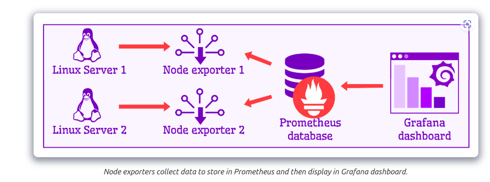

# Monitoring Stack with Prometheus, Node Exporter, NVIDIA SMI Exporter, and Grafana

This Docker Compose stack deploys a monitoring solution that includes Prometheus for metric storage and querying, Node Exporter for host-level metrics, NVIDIA SMI Exporter for NVIDIA GPU metrics, and Grafana for metric visualization.

## Services

- `node_exporter`: Collects system-level metrics from the host machine.
- `nvidia_smi_exporter`: Collects NVIDIA GPU metrics. Requires NVIDIA drivers and devices to be present on the host in `/dev`.
- `prometheus`: Stores time-series data collected from exporters. It provides a robust query language (PromQL) for querying this data.
- `grafana`: Visualizes time-series data. It provides numerous options for creating dashboards based on Prometheus data.

## Usage

To start the stack, you need to have Docker and Docker Compose installed. Download the `docker-compose.yml` and then run the following command in the directory containing the file:

### config prometheus
```bash
global:
  scrape_interval: 15s

scrape_configs:

  - job_name: "node_exporter"
    static_configs:
      - targets: ["node_exporter:9100"] # call the service name not localhost because prometheus is in the same network with node_exporter

  - job_name: "nvidia_gpu_exporter"
    static_configs:
      - targets: ["nvidia_smi_exporter:9835"] # call the service name not localhost because prometheus is in the same network with nvidia_smi_exporter
```
```bash
docker-compose up -d
```
Once the services are running, you can access the following interfaces in a web browser:

Prometheus: `http://<host-ip>:9090`
Grafana: `http://<host-ip>:3000` (default admin user is nghiaph and password is nghiaclear, please change them if this is going to be exposed publicly)
# Exporter

https://github.com/NVIDIA/dcgm-exporter

https://github.com/prometheus/node_exporter


https://github.com/utkuozdemir/nvidia_gpu_exporter

# Grafana board template

https://grafana.com/grafana/dashboards/1860-node-exporter-full/

https://grafana.com/grafana/dashboards/12239-nvidia-dcgm-exporter-dashboard/

https://grafana.com/grafana/dashboards/14574-nvidia-gpu-metrics/

# troubleshooting

To check exporter is working or not, you can use curl command to check

```bash
curl http://localhost:9100/metrics # node_exporter remember to expose to port 9100
curl http://localhost:9835/metrics # nvidia_smi_exporter remember to expose to port 9835
```
To check if prometheus receive data from exporter, you can use prometheus web interface to check

```bash
http://localhost:9090/targets?search=
```